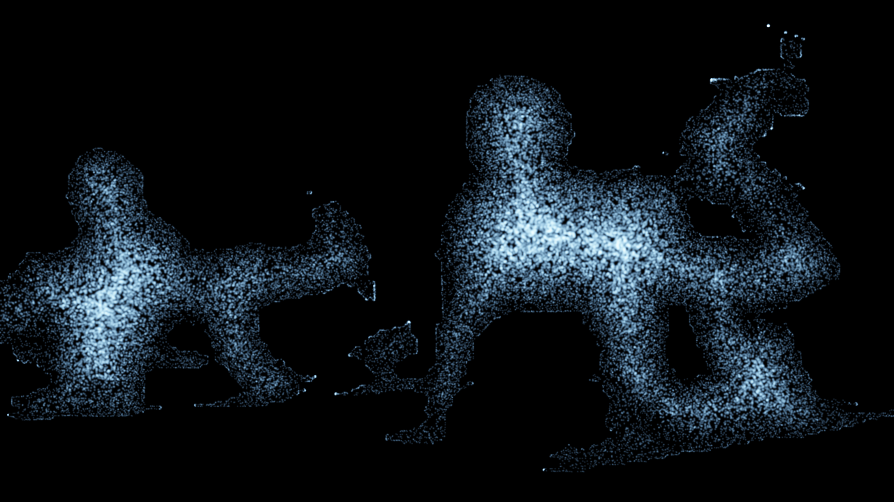

# designing-touch

Turn **video and sound into flowing particle visuals**, in real time — a modular,
code-first take on the kind of generative effects you'd build in TouchDesigner, but driven
from a terminal or a simple control panel instead of a GUI node graph.

Point your webcam at yourself and you dissolve into a luminous, flowing cloud of particles.
Dance, play music, and it moves with you.



## Quick start

```bash
git clone https://github.com/NimbleCoAI/designing-touch
cd designing-touch
python3 -m venv .venv && source .venv/bin/activate
pip install -e ".[person]"        # engine + person segmentation
python experiments/05-live-webcam/run.py
```

On macOS you can also just **double-click `start.command`** (it sets up the environment on first
run, then opens the window). Grant your terminal **Camera** (and **Microphone**, for sound) access
in System Settings → Privacy & Security.

## The live instrument

One window: the live render plus a collapsible control panel (click the `>` to fold it away).

- **Templates** — one-click looks: `abstract` (glowing cloud), `portrait`/`textured`
  (recognizable, painted with your real colors), `embers`, `aurora`, and **`sigil`** (sharp
  fractal contour lines — move, then hold still and watch them form). Save your own with
  "Save current look".
- **Source** — `matte` (what becomes particles: motion / saliency / person / edges / luma),
  `output` resolution (720p → 4K).
- **Look** — color palette + sliders for Trails, Glow, Spark, Flow, Size, Count, and the sigil
  knobs Glide / Pull / Reseed. Every slider has an `i` tooltip.
- **Audio** — toggle sound reactivity (bass pulses brightness; treble adds spark where Spark > 0)
  and a sensitivity slider.
- **Record** — capture an MP4 of your session.

Quit via the **Quit** button, `q`, or the window's close box.

## The engine (`dtouch/`)

A small package of composable operators — sources, mattes, a particle-flow simulation, GPU glow
renderer, a 2D stable-fluids solver, audio analysis, and a tiny node-graph spine. Rendering is
headless (moderngl) so everything is scriptable and inspectable. See **[AGENTS.md](AGENTS.md)** for
the architecture and how to extend it, and **[docs/autonomy-pattern.md](docs/autonomy-pattern.md)**
for the self-verifying design philosophy.

## Experiments

Standalone studies, each in `experiments/NN-name/` with its own README and `run.py`:

| #  | Experiment        | What it explores                                        |
|----|-------------------|---------------------------------------------------------|
| 01 | displacement      | luminance displacement, instanced boxes, light/depth    |
| 02 | shadows           | depth-from-light shadow mapping                          |
| 03 | audio-reactive    | sound → displacement                                     |
| 04 | fluid             | stable-fluids advection of a particle field             |
| 05 | live-webcam       | the real-time interactive instrument (above)            |

## Tests

```bash
pytest tests/ -q
```

Verified on Apple Silicon (Metal-backed GL 4.1). The render tests need a GPU/GL context.

## License

[GNU AGPL-3.0](LICENSE). If you run a modified version as a network service, you must offer users
its source. Contributions welcome — see [AGENTS.md](AGENTS.md).
