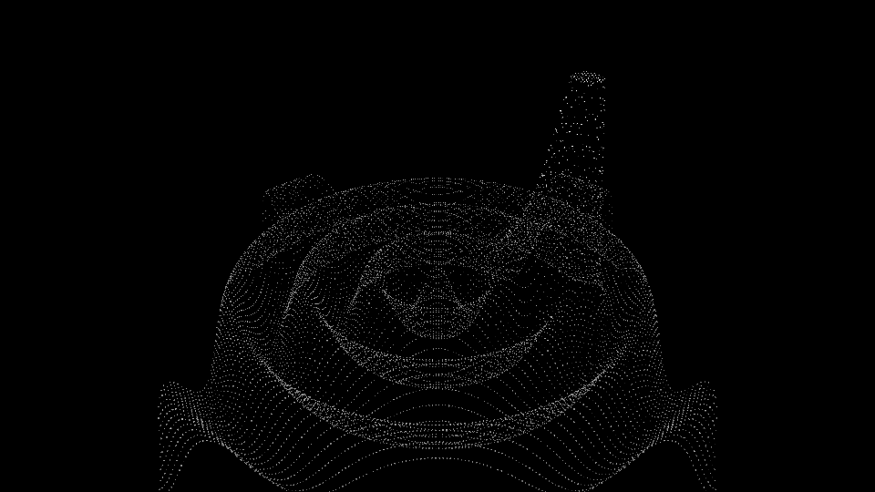

# 01 — Displacement Particle System

Recreates a classic TouchDesigner graph **without TouchDesigner**, as modular, CLI-driven
Python that an agent or a TUI can drive.

## The TouchDesigner graph being ported

```
TOP (video/webcam)  ->  TOP to POP  ->  displace points by luminance (height = r)
                    ->  Random (scale)  +  Random (rotation)
                    ->  Copy SOP instancing a tiny box per point
                    ->  Light + Shadow + Depth  ->  render
```

## The code equivalent (operators)

Each stage is a small, pure operator in `ops/` — the "node graph as code" seed:

| TouchDesigner node            | Code (`ops/`)                                  |
|-------------------------------|------------------------------------------------|
| TOP (video in)                | `sources.py` — synthetic / image / webcam/video |
| TOP → POP                     | `field.make_grid` + `field.displace_z`         |
| Random (scale), Random (rot)  | `field.random_scale`, `field.random_euler`     |
| Copy SOP (instance a box)     | `render.Renderer` — GPU instanced unit cube     |
| Light / Depth / Camera        | `render.Renderer` — directional light, depth test |
| Movie File Out                | `imageio` (MP4) + a PNG of frame 0             |

The two randoms are generated **once** (seeded), so each dot's scale and rotation are stable
across frames; only the Z position changes with the incoming luminance — exactly the TD behavior.

## Run it

```bash
python -m venv .venv && source .venv/bin/activate
pip install -r ../../requirements.txt

# synthetic source — no camera, no input file needed (good for CI / quick checks)
python run.py --frames 90

# live webcam (grant the terminal Camera permission first)
python run.py --source webcam --frames 150

# a video file or a still image
python run.py --source clip.mp4 --grid 200x112
python run.py --source photo.jpg --frames 1

# more displacement, denser grid
python run.py --depth 1.8 --grid 240x135
```

Outputs land in `out/`: `displace.mp4` plus `displace_frame0.png`.

## Sample output (synthetic source)

The synthetic source is a bright blob orbiting over faint concentric rings. The rings render
as a topographic relief; the blob spikes toward the camera.



## What's in v1 vs. next

- **In v1:** video/synthetic input, luminance displacement, per-instance random scale + rotation,
  GPU-instanced cubes, directional light, depth test, headless MP4/PNG output on macOS (Metal-backed
  GL 4.1 via a moderngl standalone context — no window, no X server).
- **Next:** a shadow-map pass (depth-from-light) for real shadows; a live preview window
  (`moderngl-window`); audio-reactive modulation (`sounddevice` + numpy FFT); fluid dynamics
  (custom GLSL stable-fluids advection, or Taichi on Metal).

## Tests

```bash
cd experiments/01-displacement && python -m pytest tests/ -q
```

`test_field.py` covers the deterministic transforms (grid, displacement, randoms, packing);
`test_pipeline.py` is an end-to-end smoke test that renders a frame and asserts it isn't empty.
