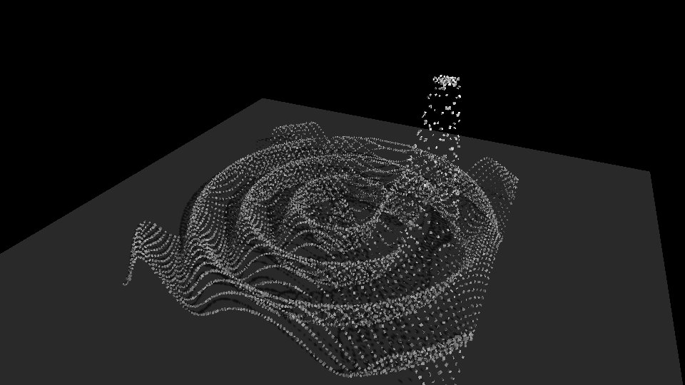

# 02 — Shadows

Experiment 01's displacement field, rendered with **real cast shadows** — the TouchDesigner
Light + Shadow + Depth stage.

## What it adds

- A **depth-from-light shadow map**: the cubes are first rendered from the light's point of
  view into a depth texture (orthographic light projection covering the scene).
- A **ground plane** the displaced cubes cast onto.
- The camera pass projects each fragment into light space and compares its depth against the
  shadow map (3×3 PCF, slope-scaled bias) to decide occlusion.

All of this lives in `dtouch.shadow.ShadowRenderer`, reusable by any experiment.

## Run

```bash
pip install -e ../..        # the dtouch engine
python run.py --frames 90
python run.py --source webcam --grid 140x80
python run.py --depth 1.8   # taller relief -> longer shadows
```

Outputs: `out/shadows.mp4` + `out/shadows_frame0.png`.

## Sample output

The synthetic relief sits on a ground plane and casts a visible shadow toward the lower-left
(grazing light from the upper-right). Depth/occlusion is correct — the ground behind the
relief is hidden by it.



## Notes / next

- Shadow legibility is a function of cube size vs. grid spacing and light angle: bigger cubes
  and a more grazing light pool denser, clearer shadows. Tuned here for a coarse grid.
- Soft shadows (PCSS / larger PCF kernel), colored/multiple lights, and SSAO would deepen it —
  candidates for a later pass.
