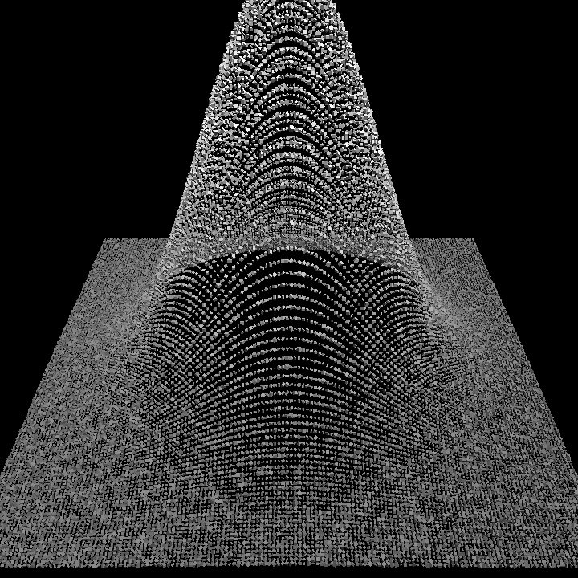
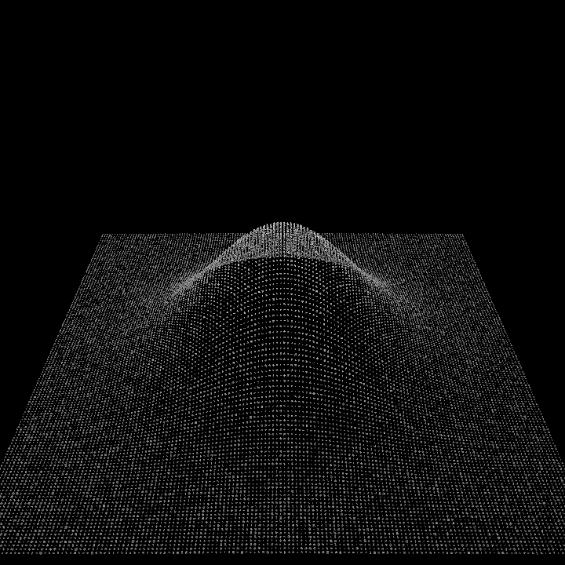

# 03 — Audio-reactive

Sound drives the geometry — the TouchDesigner CHOP stage. A static luminance mound is
displaced into a particle relief, and audio modulates it every frame:

| Band   | Drives                              |
|--------|-------------------------------------|
| bass   | displacement height (mound pumps with the kick) |
| mid    | cube size                           |
| treble | rotation speed (dots spin on hi-hats) |

## The audio operator (`dtouch.audio`)

- `analyze_block(samples, sr)` — rFFT → RMS amplitude + bass/mid/treble energy (unit-tested).
- `SyntheticAudio` — a deterministic 120 BPM kick + tremolo tone + hi-hat signal. No mic, no
  file, no extra deps → the headless-verifiable default.
- `WavAudio(path)` — react to a real `.wav` (stdlib `wave`).
- Bands are normalized to ~[0, 1] per signal so the visual mapping is loudness-independent.

Live mic is deliberately omitted from the engine (needs `sounddevice` + macOS mic permission,
which breaks unattended runs); add it behind a flag when driving a live performance.

## Run

```bash
pip install -e ../..
python run.py --frames 90              # synthetic beat
python run.py --audio song.wav --frames 300
```

Outputs: `out/audio.mp4`, plus `_frame0`, `_peak`, `_trough` PNGs at the bass extremes.

## Sample output

Bass **peak** vs **trough** — same mound, height pumped by the kick:

 
