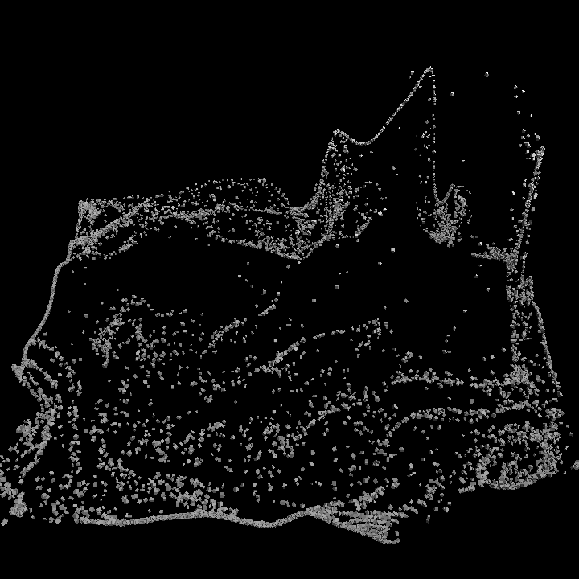

# 04 — Fluid dynamics

The particle field flows through a **2D stable-fluids** velocity field. The regular grid is
stirred into swirls and filaments by the video.

## How it works

- `dtouch.fluid.Fluid2D` — a Jos Stam "Stable Fluids" solver: Jacobi pressure projection +
  semi-Lagrangian advection, pure NumPy (unit-tested: divergence reduction, advection
  transport, finiteness, sampling).
- Each frame the video's luminance injects:
  - **force along the iso-contours** of luminance (perpendicular to its gradient), so flow
    curls *around* bright regions instead of just pushing outward;
  - **density** where it's bright.
- Particles are advected by sampling the velocity field; their height is the advected density.
  A weak spring pulls them home so the field stays bounded over long clips.

## Run

```bash
pip install -e ../..
python run.py --frames 120
python run.py --source clip.mp4 --force 12 --grid 120x120
```

Outputs: `out/fluid.mp4` + `frame0` / `mid` / `end` PNGs.

## Sample output

By the end of the clip the grid has been advected into clear fluid flow — swirls, streaks, and
density ridges:



## Notes / next

- This is a CPU NumPy solver (fast enough: ~120 frames/sec at 100×100). Porting the solver to
  GLSL ping-pong FBOs (Metal-native via moderngl) would scale it to high-res real-time —
  the planned GPU path.
- Vorticity confinement would sharpen the swirls; coupling fluid height into the shadow
  renderer (exp 02) would give the flow cast shadows.
