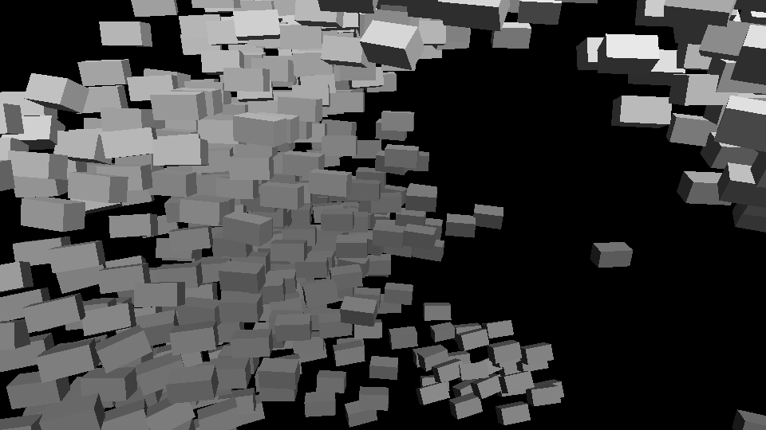

# 06 — Flocking



**TouchDesigner feature targeted:** POP-based particle simulation with per-point
neighbour forces (the kind you'd wire as a feedback loop of `Particle SOP` /
custom POP VEXpressions), driving an instanced `Copy SOP` render. Here the whole
graph is code: a Reynolds boids solver in NumPy → oriented instanced cubes through
the shared `dtouch` renderer.

## What it is

Classic Reynolds flocking in 3D — **separation, alignment, cohesion** — over a soft
spherical boundary, with a slow global swirl. No leader, no script. Every boid reads
only its neighbours inside a radius, and the coherent shoal (with breakaway
sub-flocks and scouts) is produced by those three local rules alone. Each instance is
elongated and oriented along its velocity, so motion reads as a directed shoal rather
than a drifting cloud.

It is the simplest honest picture of a polycentric system: order that is *grown* from
local interaction, not imposed from a center. Many centers, not one.

## Run

```bash
python experiments/06-flocking/run.py                       # 700 boids, 240 frames
python experiments/06-flocking/run.py --boids 1200 --frames 600
python experiments/06-flocking/run.py --cohesion 0.4 --separation 2.4   # looser, more lanes
python experiments/06-flocking/run.py --no-recenter         # let the shoal wander out of frame
```

Writes `out/flock.mp4` plus `out/flock_frame0.png` and `out/flock_mid.png`.

## Knobs

| Flag | Effect |
|------|--------|
| `--boids` | flock size (O(n²) neighbour pass — comfortable into the low thousands) |
| `--neighbor` / `--sep-radius` | how far a boid sees / how close is "too close" |
| `--cohesion` / `--alignment` / `--separation` | the three Reynolds weights — the whole character lives here |
| `--swirl` | a breath of shared global weather over the local rules |
| `--bound` | containment-sphere radius |
| `--recenter` / `--no-recenter` | track the shoal's centroid (framed) vs. let it wander |

Tuning note: raise `--separation` relative to `--cohesion` and the single mass breaks
into lanes and competing sub-flocks; reverse it and they fuse into one ball. The
interesting regime is the edge between the two.
